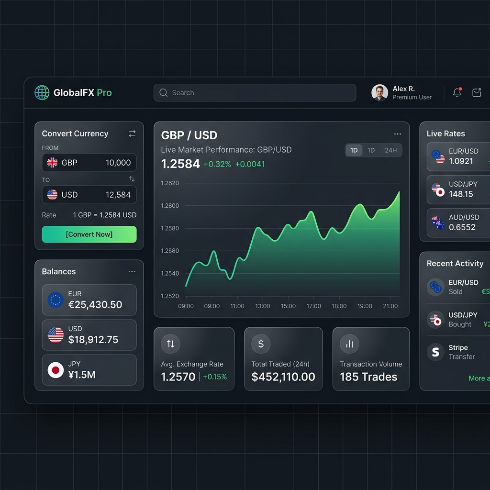
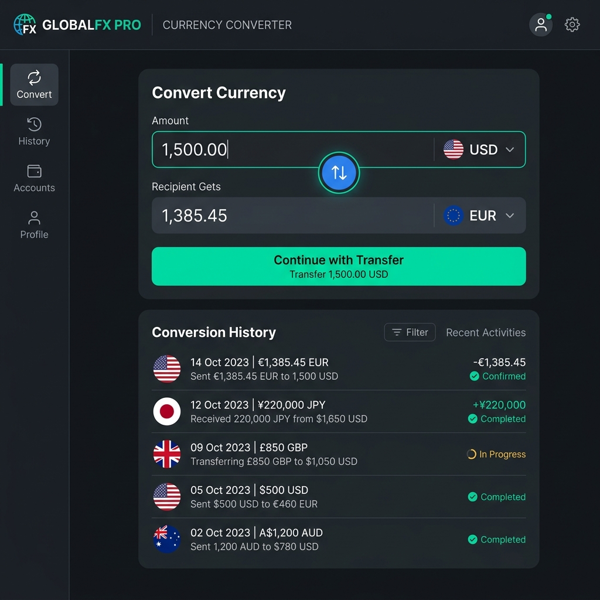
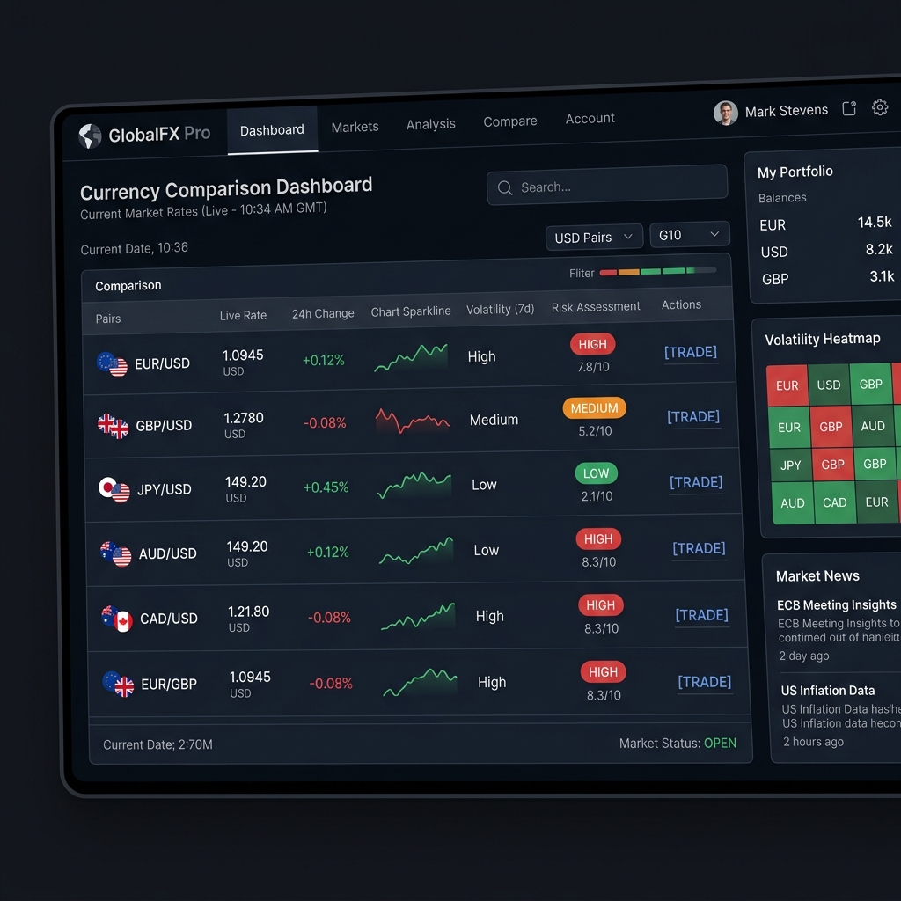
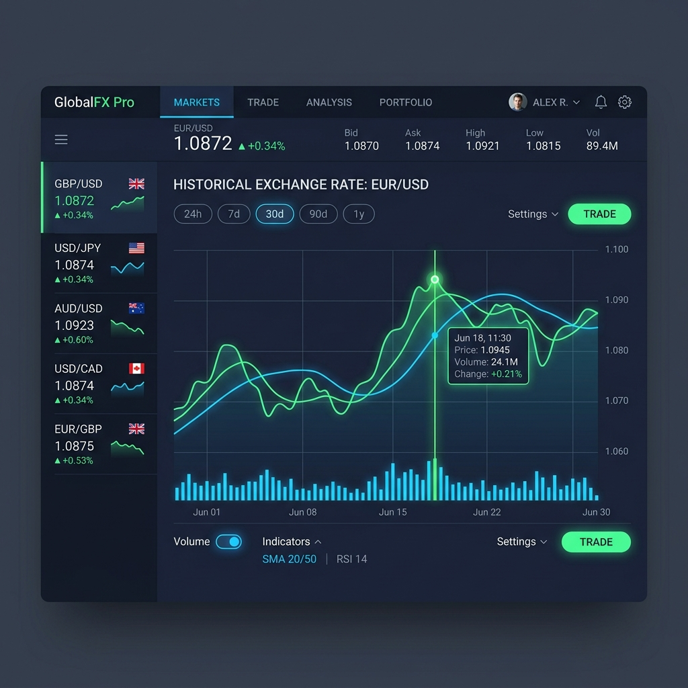
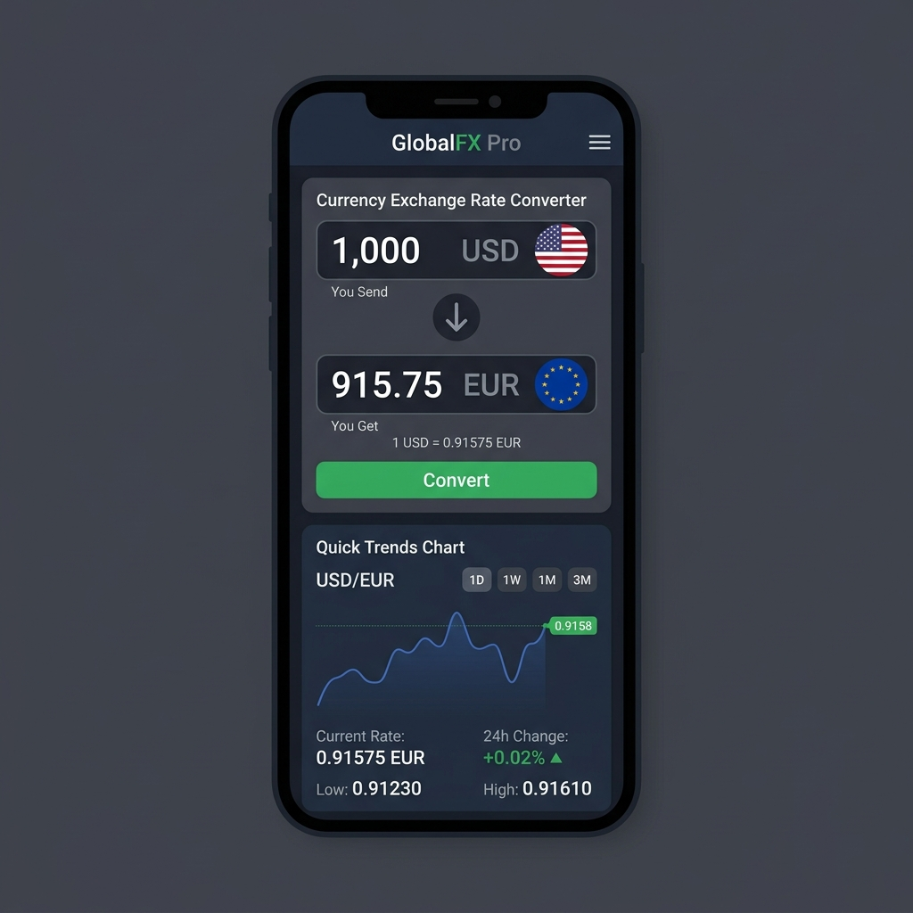

# GlobalFX Pro
### Real-Time Global Currency Exchange & Analytics Platform

GlobalFX Pro is a premium, production-grade fintech currency exchange and market analytics platform. Built completely from scratch using vanilla HTML5, CSS3, and modern modular ES6+ JavaScript, it delivers a sleek, high-fidelity experience matching top industry platforms like Wise, Revolut, Stripe, and Google Finance.

---

## 🚀 Key Features

- **Premium Responsive UI**: Sleek, glassmorphic design system using CSS Variables, Flexbox, and CSS Grid, supporting seamless real-time light and dark theme toggling.
- **Custom Searchable Currency Selectors**: Dual searchable select dropdowns featuring country flags, keyboard accessibility (Arrow keys, Enter, Escape), and debounced search matching code, full currency names, and countries.
- **Real-Time Currency Conversion**: Exchange fiat currencies instantly using a rate engine connected to live feeds, with robust cache policies to prevent redundant queries.
- **Interactive Historical Charting**: Dynamic visual trendlines powered by Chart.js featuring canvas gradient fills, responsive grid axis lines, custom tooltips, and timeframe toggles (`24H`, `7D`, `30D`, `90D`, `1Y`).
- **Movers & Volatility Dashboard**: Daily gainers and losers tracker combined with volatility scoring systems classifying risk zones (🟢 Low, 🟡 Medium, 🔴 High).
- **User Analytics Tracker**: Metric cards assessing total conversions, average conversion amount (scaled to USD), and most active pair.
- **Transaction Logs**: Dynamic audit history list synced securely with local browser `localStorage`.
- **CSV Data Exporter**: One-click download tool compiling logs into clean CSV worksheets.

---

## 🛠️ Technology Stack

- **Structure**: HTML5 (Semantic tags, SEO metadata tags)
- **Styling**: Vanilla CSS3 (Custom theme properties, custom responsive grids, keyframes, button click ripples)
- **Programming**: Vanilla JS ES6+ (Class-based object-oriented architecture, LocalStorage, CSV download triggers)
- **Visuals**: Chart.js (Gradient fills, ease transitions, adaptive themes)
- **API Endpoint**: ExchangeRate API (Live feed rate maps with deterministic offline walks as fallback)

---

## 📸 Project Screenshots

### Home Dashboard


---

### Currency Converter


---

### Analytics Dashboard


---

### Historical Charts


---

### Mobile View


---

## 📂 Project Directory Structure

```text
globalfx-pro/
├── index.html                  # Main Application UI Structure & Views
├── README.md                   # Comprehensive repository documentation
├── css/
│   ├── style.css               # Design system tokens, glassmorphism layouts, light/dark custom properties
│   ├── animations.css          # Keyframes, fade-ins, loading skeleton pulse, button click ripples
│   └── responsive.css          # Viewport media queries for mobile, tablet, and ultra-wide screens
├── js/
│   ├── app.js                  # Main coordination orchestrator & app bootstrap
│   ├── api.js                  # Encapsulates CurrencyAPI class (fetching, caching, deterministic history, volatility metrics)
│   ├── converter.js            # Encapsulates CurrencyConverter class (conversion math & transaction commits)
│   ├── analytics.js            # Encapsulates AnalyticsManager class (logs compilation, volume counts, market overview stats)
│   ├── charts.js               # Encapsulates ChartManager class (Chart.js creation & theme overrides)
│   ├── storage.js              # Encapsulates StorageManager class (localStorage reads/writes)
│   ├── export.js               # Encapsulates ExportManager class (CSV file formatter & download trigger)
│   └── ui.js                   # Encapsulates UIManager class (renders views, triggers alerts, custom searchable dropdown widgets)
└── screenshots/                # Beautiful high-end platform mockups
    ├── dashboard.png
    ├── converter.png
    ├── analytics.png
    ├── charts.png
    └── mobile.png
```

---

## ⚙️ Installation & Running

1. Clone or download the project files.
2. Navigate to the project directory:
   ```bash
   cd globalfx-pro
   ```
3. Open `index.html` in any modern web browser directly (or run a local dev server e.g. using `live-server` or `npx http-server`).
   ```bash
   open index.html
   ```

---

## 🔮 Future Enhancements

- **AI Exchange Rate Prediction**: Machine learning regressions predicting trend lines based on historical volatility.
- **Forex Portfolio Tracker**: Balance logs calculating historical ROI across foreign asset reserves.
- **PWA Support**: Support offline usage and quick home screen launching on mobile environments.
- **Active Alerts**: Real-time push notifications when threshold exchange levels are breached.

---

## ✍️ Author & License

- Developed by **Tanmay Tyagi** - [GlobalFX Pro]
- Licensed under the **MIT License** - see the LICENSE details for permissions.
